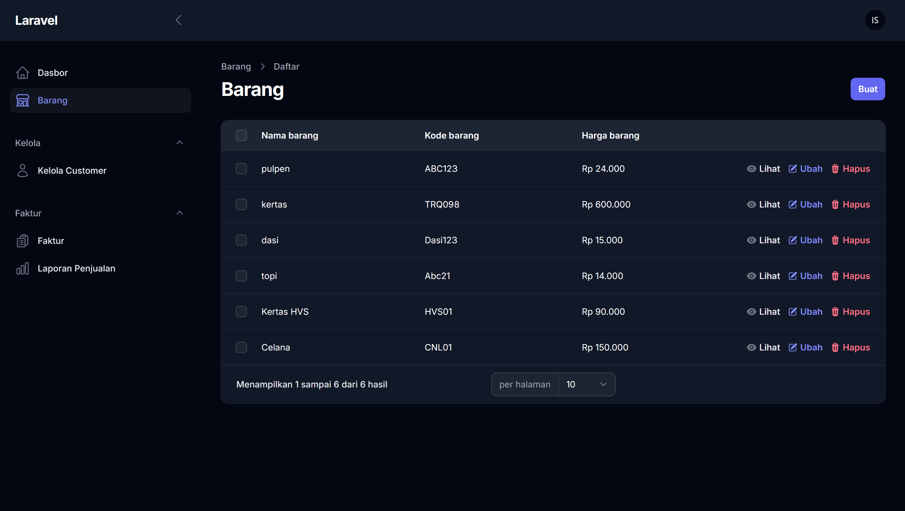
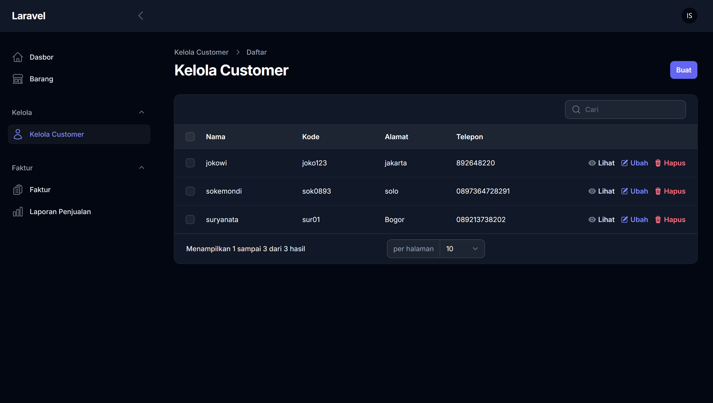
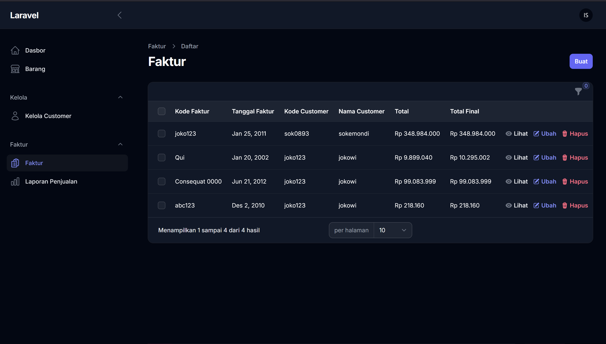
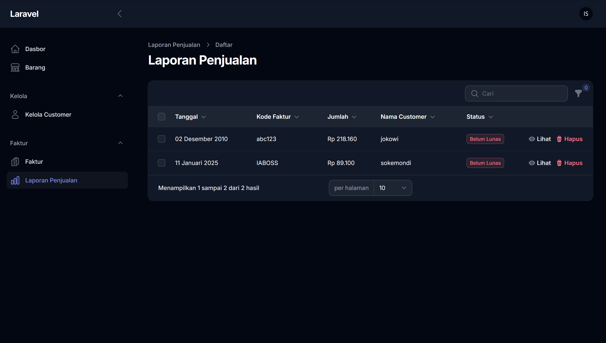

# Laravel Invoice Management System

Aplikasi ini adalah sistem manajemen faktur yang dikembangkan menggunakan framework Laravel dengan integrasi Laravel Filament. Aplikasi ini dirancang untuk membantu pengguna mengelola data pelanggan, barang, dan faktur dengan fitur CRUD (Create, Read, Update, Delete) serta laporan penjualan.

## Fitur Utama

1. **Dasbor**: Menampilkan ringkasan informasi utama.
2. **Manajemen Barang**: Mengelola data barang.
3. **Manajemen Pelanggan**: Mengelola data pelanggan.
4. **Faktur**:
    - Menampilkan daftar faktur.
    - Melihat detail faktur.
    - Menambahkan, mengedit, dan menghapus faktur.
5. **Laporan Penjualan**: Melihat laporan penjualan berdasarkan data faktur.

## Teknologi yang Digunakan

-   **Framework**: Laravel 11
-   **Admin Panel**: Laravel Filament
-   **Frontend**: Blade Template Engine dengan Tailwind CSS (opsional)
-   **Database**: SQLite
-   **Autentikasi**: Laravel Breeze atau Jetstream (opsional)

## Instalasi

1. Clone repository ini:

    ```bash
    git clone <repository-url>
    ```

2. Masuk ke direktori project:

    ```bash
    cd <nama-folder>
    ```

3. Instal dependensi menggunakan Composer:

    ```bash
    composer install
    ```

4. Salin file `.env.example` menjadi `.env`:

    ```bash
    cp .env.example .env
    ```

5. Atur konfigurasi database di file `.env`:

    ```env
    DB_CONNECTION=sqlite
    DB_DATABASE=/path/to/database.sqlite
    ```

    Buat file database SQLite jika belum ada:

    ```bash
    touch database/database.sqlite
    ```

6. Generate application key:

    ```bash
    php artisan key:generate
    ```

7. Jalankan migrasi database:

    ```bash
    php artisan migrate
    ```

8. Instal Laravel Filament:

    ```bash
    composer require filament/filament
    ```

9. Publish aset dan konfigurasi Filament:

    ```bash
    php artisan filament:install
    ```

10. (Opsional) Seed database dengan data awal:

```bash
php artisan db:seed
```

11. Jalankan aplikasi:

```bash
php artisan serve
```

12. Akses aplikasi di browser di alamat berikut:
    ```
    http://localhost:8000
    ```
    Untuk mengakses panel admin Filament:
    ```
    http://localhost:8000/admin
    ```

## Cara Penggunaan

### Kelola Data Pelanggan

-   Tambahkan data pelanggan baru melalui menu **Kelola Customer** di panel admin Filament.
-   Edit atau hapus data pelanggan sesuai kebutuhan.

### Kelola Data Barang

-   Tambahkan data barang melalui menu **Barang** di panel admin Filament.
-   Edit atau hapus barang yang sudah terdaftar.

### Kelola Faktur

-   Buat faktur baru melalui tombol **Buat** di halaman Faktur.
-   Lihat detail faktur menggunakan tombol **Lihat**.
-   Edit atau hapus faktur menggunakan tombol **Ubah** dan **Hapus**.

### Laporan Penjualan

-   Lihat laporan penjualan di menu **Laporan Penjualan** untuk menganalisis data penjualan.

## Struktur Folder Penting

-   `app/Models`: Berisi model database.
-   `app/Http/Controllers`: Berisi controller untuk logika aplikasi.
-   `resources/views`: Berisi file tampilan Blade.
-   `routes/web.php`: Berisi rute aplikasi.
-   `routes/filament.php`: Berisi rute khusus untuk Laravel Filament.

## Kontribusi

Silakan ajukan pull request jika ingin berkontribusi dalam pengembangan aplikasi ini. Pastikan Anda mengikuti pedoman kontribusi.

## Lisensi

Aplikasi ini dilisensikan di bawah [MIT License](LICENSE).

---

### Screenshot

#### Tampilan Barang



#### Tampilan Customer



#### Tampilan Faktur



#### Tampilan Laporan Penjualan



---

Terima kasih telah menggunakan aplikasi ini!
